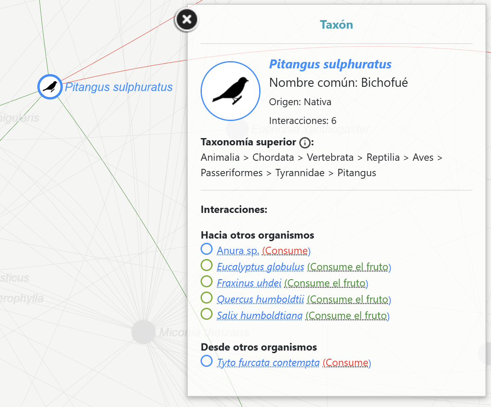
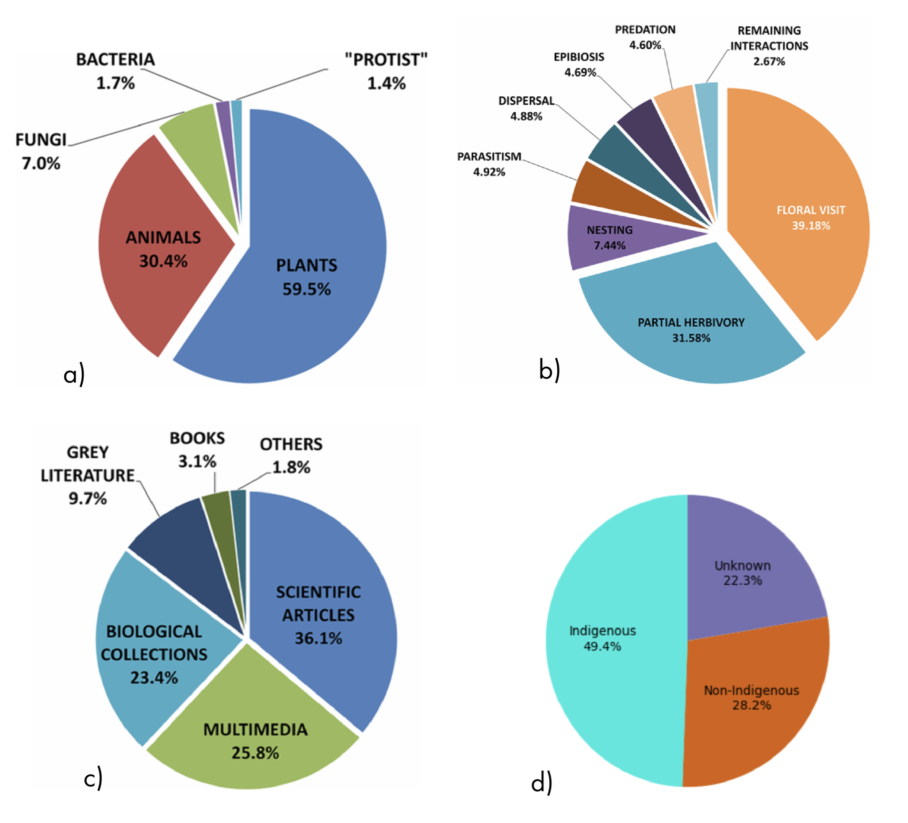
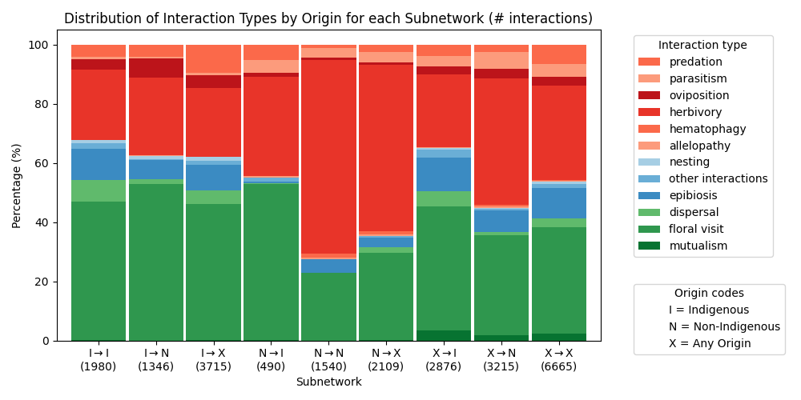
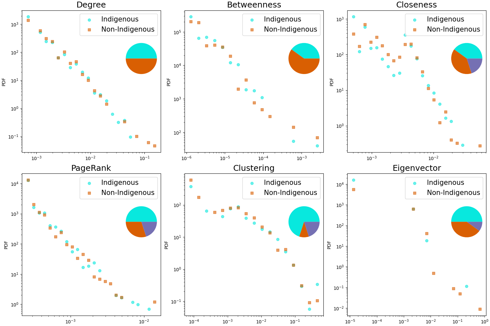
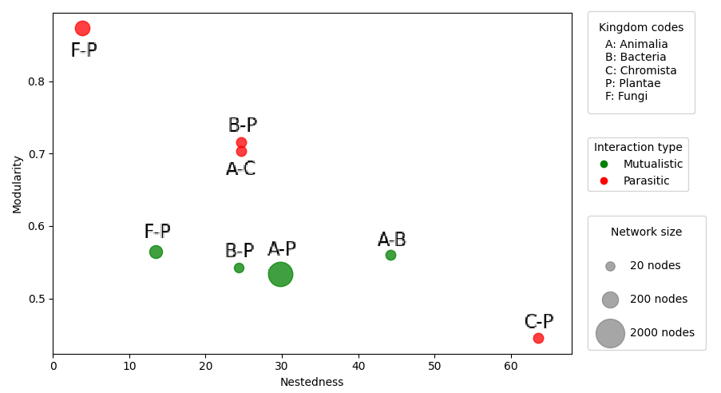
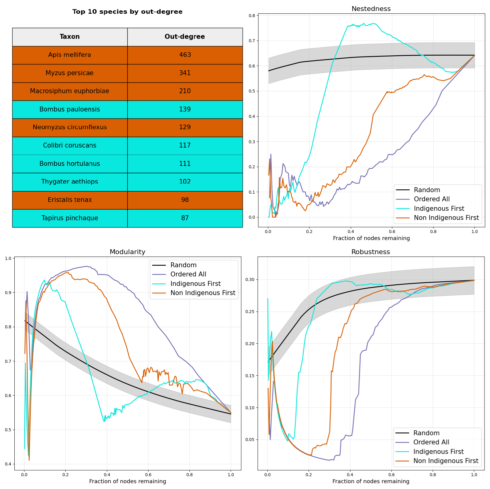

# Ecological Interaction Network of Bogotá

## Overview
This repository contains the analysis of a biotic interaction network of Bogotá constructed from data provided by the Jardín Botánico de Bogotá. The network integrates directed ecological interactions across multiple kingdoms (Animalia, Plantae, Fungi, Bacteria, and Protozoa), including both mutualistic and antagonistic relationships. The project explores how network architecture, species origin, and interaction types shape ecological organization and resilience.

---

## Quick visual summary
- **Network structure and example neighborhood:**  
  `Figures/Network.png`  
  

- **Dataset composition and basic properties (kingdoms, origin, data sources):**  
  `Figures/paichars.png`  
  

---

## Objectives
- Build a directed ecological interaction network from biodiversity records.
- Characterize architectural properties such as modularity and nestedness.
- Compare the structural roles of Indigenous (native) and Non-Indigenous species.
- Evaluate network resilience under different node-removal strategies.
- Identify potential structural transitions associated with loss of robustness.

---

## Methods
Network analyses were performed using standard graph-theoretical tools (primarily **NetworkX**):

- **Modularity:** greedy Newman algorithm  
- **Nestedness:** NODF metric (classical definition)  
- **Centrality:** in-degree, out-degree, PageRank, eigenvector, closeness, betweenness, clustering  
- **Density and robustness:** monitored during progressive node removal  

Species were classified as Indigenous or Non-Indigenous using metadata from the original database.

Node-removal experiments included:
- Random removal (baseline),
- Targeted removal by highest out-degree,
- Indigenous-first removal (random order within group),
- Non-Indigenous-first removal (random order within group).

Isolated nodes were removed between steps to account for secondary extinctions.

---

## Main Results

### 1. Network structure and dataset composition
The global structure of the network and an example of local connectivity are shown in `Network.png`. Summary pie charts in `paichars.png` highlight the dominance of Animalia and Plantae in the dataset, with Fungi and microbial kingdoms being less represented. This imbalance is an important caveat when interpreting structural metrics.

---

### 2. Interaction-type distributions by species origin
**Figure:** `Figures/InteractionType.png`  

The distribution of interaction types varies across origin–origin subnetworks. Subnetworks originating from Indigenous species generally show a lower proportion of antagonistic interactions, whereas Non-Indigenous–origin subnetworks display a higher frequency of parasitic and predatory links. These differences may reflect ecological strategies, but also potential sampling biases.

---

### 3. Centrality patterns of Indigenous vs Non-Indigenous species
**Figure:** `Figures/CentralityMeasures.png`  

Across standard centrality measures, Indigenous and Non-Indigenous species exhibit largely overlapping distributions. However, the highest-ranked nodes (top degree, PageRank, eigenvector) are predominantly Non-Indigenous species, indicating that non-native taxa often occupy structurally influential positions in the network.

---

### 4. Inter-kingdom nestedness and modularity
**Figure:** `Figures/InterKingdom.png`  

Nestedness (NODF) and modularity were computed for mutualistic and parasitic inter-kingdom subnetworks that met a minimum size threshold. Parasitic subnetworks tend to be more modular than mutualistic ones, in line with theoretical expectations. Nestedness values show strong sensitivity to subnetwork size and sparsity, with the highest NODF values often appearing in the smallest subnetworks.

---

### 5. Network resilience under node removal
**Figure:** `Figures/NodeRemoval.png`  

Targeted removal of highly connected species leads to markedly different dynamics than random removal. Under targeted attacks, modularity often increases temporarily, indicating fragmentation into modules, while robustness collapses rapidly. Removing Non-Indigenous species first produces faster and stronger structural changes than removing Indigenous species first, highlighting the disproportionate role of non-native hubs in maintaining connectivity.

---

## Interpretation and caveats
- Non-Indigenous species frequently act as hubs and may disproportionately influence global connectivity.
- Nestedness estimates (NODF) are highly sensitive to network size and density; results should be interpreted cautiously.
- Modularity patterns are more robust, especially for parasitic interactions.
- Sampling bias and underrepresentation of certain kingdoms (e.g., microbes, fungi) limit strong ecological generalizations.

---

## Future directions
- Expand and balance data coverage, especially for underrepresented kingdoms.
- Apply null models to assess the statistical significance of nestedness and modularity.
- Explore resilience models that include rewiring or explicit secondary-extinction dynamics.
- Incorporate trait-based or functional information to better interpret species roles.

---

## Repository contents
- `data/` — input tables and metadata  
- `notebooks/` — analysis notebooks  
- `Figures/` — figures used in the README and manuscript  
- `README.md` — project overview and results summary
