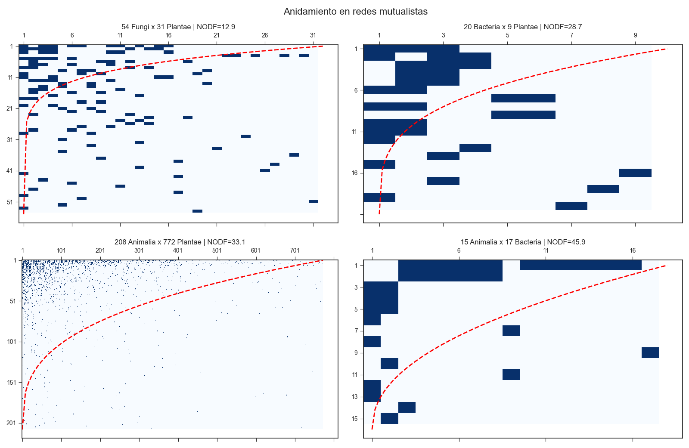
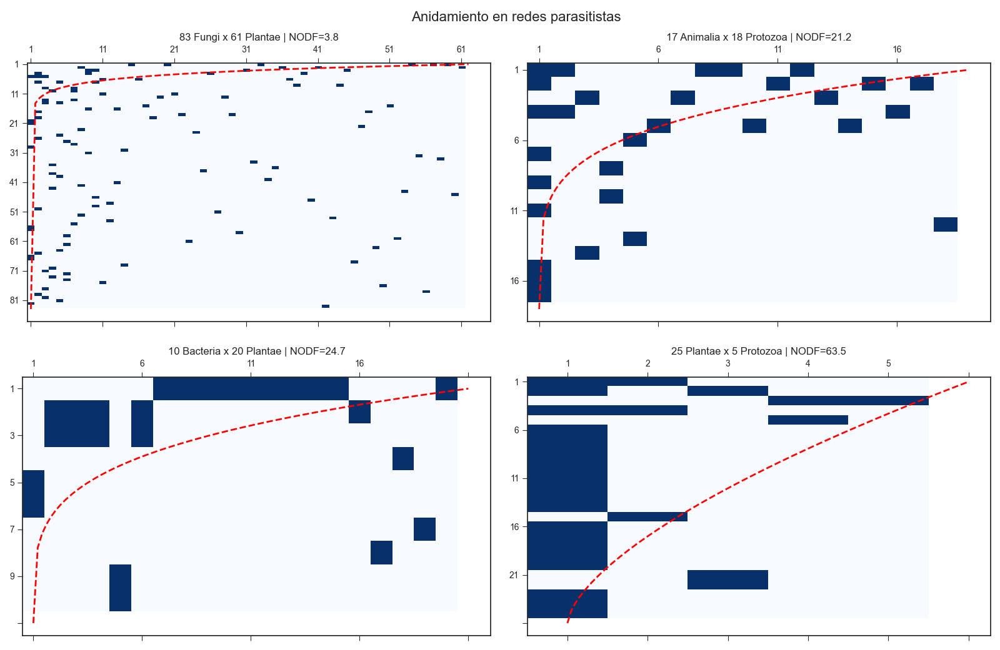
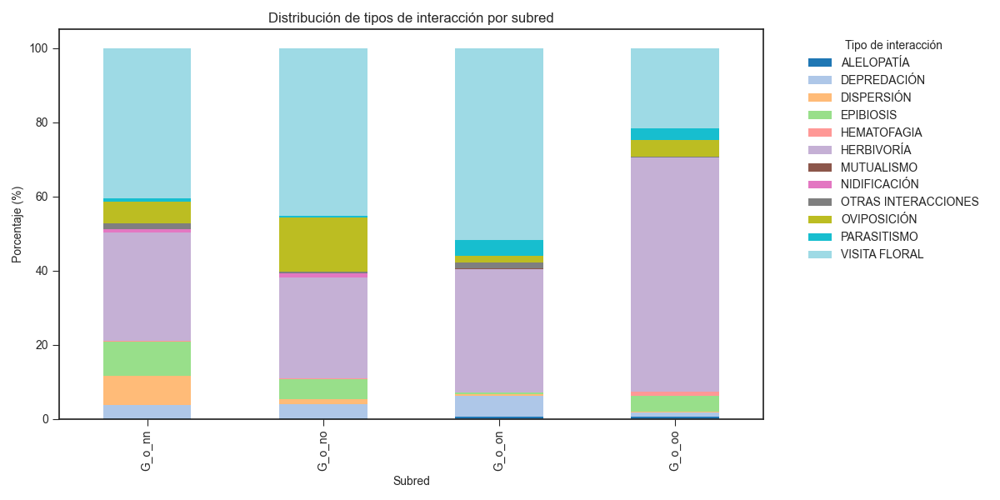
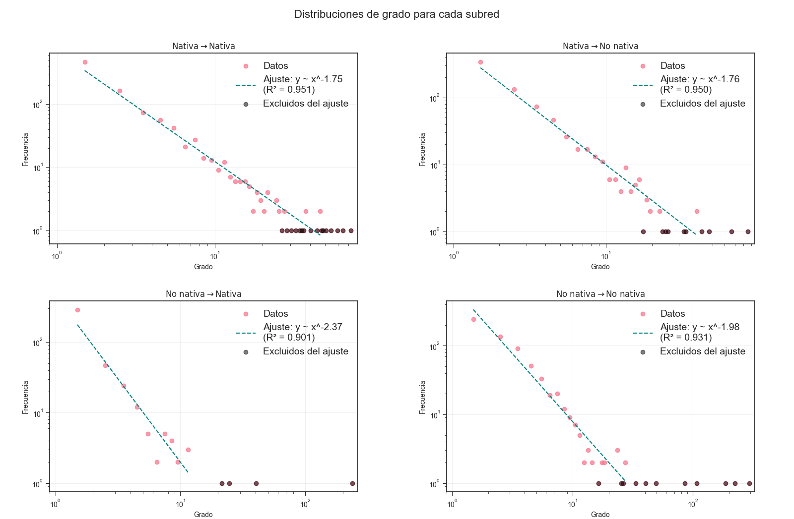
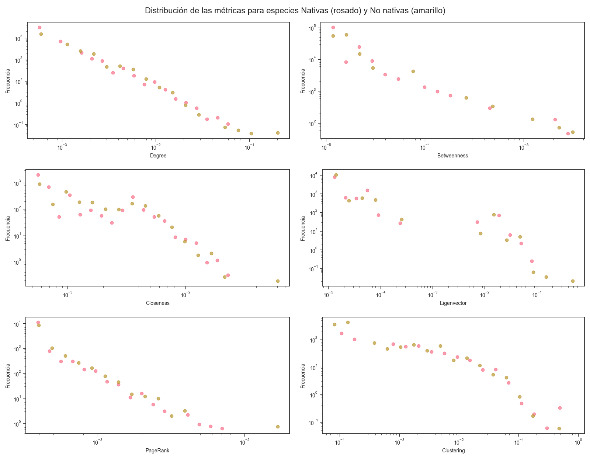
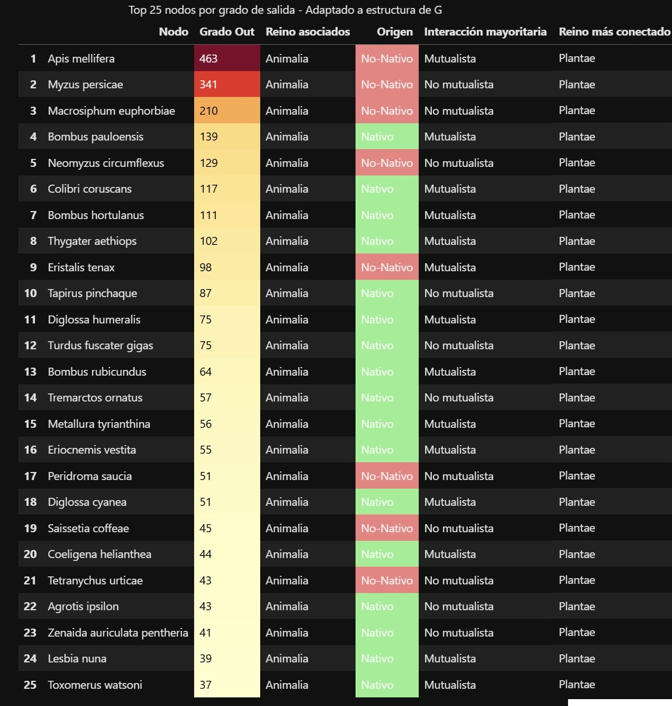
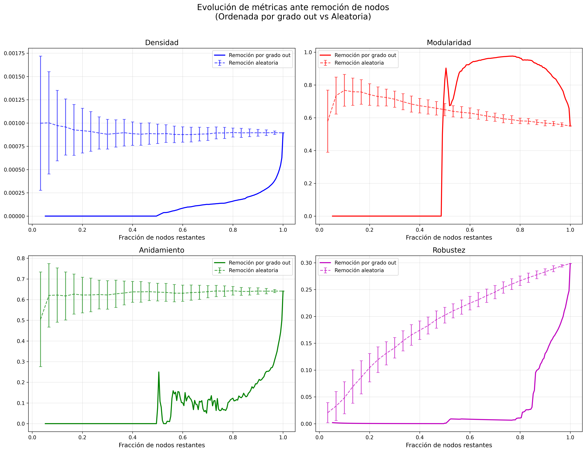

# Ecological Interaction Network of Bogotá

## Overview
This repository contains the analysis of the biotic interaction network of Bogotá, built from publicly available data from the Jardín Botánico de Bogotá. The network integrates interactions across multiple kingdoms (plants, animals, fungi, bacteria, protozoa), including mutualistic and parasitic relationships. The project was developed as part of the *Introduction to Sociophysics* course and explores how network structure relates to ecological organization and resilience.

---

## Objectives
- Construct a directed interaction network from ecological records.
- Quantify structural properties such as modularity, nestedness, clustering, and centrality metrics.
- Compare native vs. non-native species in network position.
- Evaluate robustness under targeted removal of species.
- Identify abrupt structural transitions indicative of loss of resilience.

---

## Methods
Network properties were computed using standard graph-theoretical tools:

- Modularity — greedy Newman algorithm
- Nestedness — NODF metric
- Centrality — degree (in/out), PageRank, closeness, betweenness
- Clustering coefficient
- Density
- Robustness — size of the largest strongly connected component under node removal

Species were classified as native or non-native using metadata from the database.

A targeted attack strategy was performed by iteratively removing nodes with the highest out-degree.

---

## Main Results

All results below follow the analyses reported in the project document. Figures 3–9 from the report are included as figure placeholders.

### 1. Nestedness between kingdoms (mutualistic subnetworks)
Mutualistic subnetworks that passed the size threshold show different NODF values:
- **Fungi–Plantae:** NODF = 12.9  
- **Bacteria–Plantae:** NODF = 28.7  
- **Animalia–Plantae:** NODF = 33.1  
- **Animalia–Bacteria:** NODF = 45.9

These matrices and their isoclines are shown in Figure 3.  

---

### 2. Nestedness between kingdoms (parasitic subnetworks)
Parasitic subnetworks that met the threshold present larger variability in NODF:
- **Fungi–Plantae:** NODF = 3.8  
- **Animalia–Protozoa:** NODF = 21.2  
- **Bacteria–Plantae:** NODF = 24.7  
- **Plantae–Protozoa:** NODF = 63.5

See the corresponding interaction matrices in Figure 4.  

---

### 3. Interaction-type composition by origin (native / non-native)
The most characteristic interaction types by subnetwork (deviations from the overall average) are:

- **Native–Native:** DISPERSIÓN, EPIBIOSIS, VISITA FLORAL  
- **Native–Non-native:** DEPREDACIÓN, OVIPOSICIÓN, VISITA FLORAL  
- **Non-native–Native:** DEPREDACIÓN, PARASITISMO, VISITA FLORAL  
- **Non-native–Non-native:** HEMATOFAGIA, HERBIVORÍA, PARASITISMO

Relative percentages by interaction type are plotted in Figure 5.  

---

### 4. Degree distributions by subnetwork
Degree distributions were fit with truncated power laws (excluding single-occurrence nodes where noted). Fitted exponents are:

- γₙ₋ₙ (Native–Native) = **1.75**  
- γₙ₋ₙₒₙ (Native–Non-native) = **1.76**  
- γₙₒₙ₋ₙ (Non-native–Native) = **2.37** *(fit excludes several very generalist non-native species)*  
- γₙₒₙ₋ₙₒₙ (Non-native–Non-native) = **1.98**

The distributions and fits are shown in Figure 6.  

---

### 5. Centrality metrics (native vs non-native)
Comparing distributions of degree, betweenness, PageRank, clustering, closeness, and eigenvector centrality:

- No large, statistically clear separation between native and non-native groups across standard centrality measures.
- The **top-ranked nodes** (degree, closeness, PageRank, eigenvector) are mostly **non-native**.
- **Clustering** scores are higher and more frequent among **native** species.
- **Betweenness** is slightly higher on average for non-native species.

Distributions are displayed in Figure 7.  

---

### 6. Species with highest out-degree (k_out)
The 25 species with largest out-degree are exclusively from **Animalia**, including both native and non-native taxa. Notable counts:

- **Apis mellifera** (non-native): 463 plant interactions  
- **Bombus pauloensis** (native): 139 interactions  
- **Colibri coruscans** (native): 117 interactions

Full bar plot appears as Figure 8.  

---

### 7. Network evolution under targeted removal (highest k_out) vs random removal
Removal protocol: iteratively remove nodes in order of highest out-degree; nodes that become isolated were removed from the analysis as described in the methods.

Observed responses (targeted removal) compared to random-removal baseline:

- **Density:** Rapid decline from initial ≈0.008 down toward zero by ~50% nodes remaining.  
- **Modularity (Q):** Increases from ~0.55 up toward ~1.0 as nodes are removed (peak near 75% nodes remaining), remains high (>0.9) until ~57%, then shows a brief second peak before collapsing to 0 after ~50%.  
- **Nestedness (NODF):** Decreases roughly exponentially until ~70% nodes remaining, shows a brief collapse between ~55–52% and a transient peak near 51%, then collapses to zero by ~50%.  
- **Robustness (composite metric):** Falls from ~0.3 to ~0.1 by ~85% nodes remaining, then exhibits an abrupt collapse to near zero well before the network fully disconnects.

These dynamics contrast with the smooth, near-linear decay observed under random removals. Time-series plots and comparison bands are shown in Figure 9.  

---

*Results summarized directly from the project report.*

